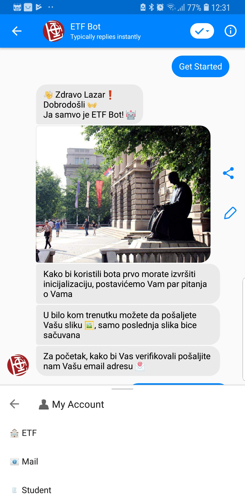
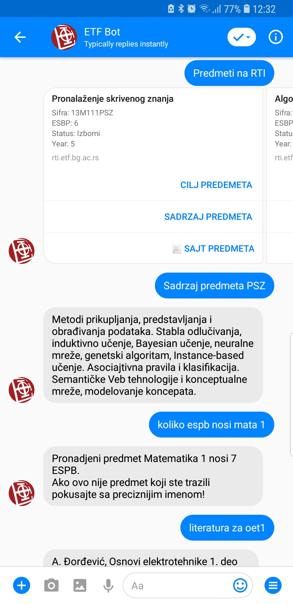

# ETF Bot
## Student Service chatbot

Student service chatbot, where students can ask about various information and dashboard for controling the bot.

## Getting Started

To get the code run next command:
```
$ git clone https://github.com/lazav94/ETF-Bot.git
```


### Prerequisites

#### To run this code you need to have:
* [Node.js](https://nodejs.org/en/download/)
* [Visual Studio Code](https://code.visualstudio.com/) - or other



<!--   -->

### Installing

You need to create an Facebook page and app and then to create _.env_ file in the root.
And you can see if you search through the project what enviroment variables do you need.


If you don't have nodemon you can install it with next command:
```
$ sudo npm i -g nodemon
```
To run the code you can do it with next commands:
```
$ nodemon
or
$ npm start
```

End with an example of getting some data out of the system or using it for a little demo

### Running the tests

_You can write you mocha tests._ And run it:

```
npm run test
```

### Technologies
* Backend: **Node.js**
* Frontend:
  * **HTML (_Pug or Jade_)**
  * **CSS (_Bootstrap_)**
  * **JavaScript (_JQuery_)**
* Database:
  * **Mongo DB (_non relational database_)**
* Bot: **Facebook graph API**
* NLP: **DialogFlow (_api.ai_)**


### Links
* [Bot](m.me/etfchatbot)
* [Dashboard](https://bot-etf.herokuapp.com)
* [Demo video - bot](https://www.useloom.com/share/935c22b2d6ab498d8602cbd9258a0e03)
* [Demo video - dashboard](https://www.useloom.com/share/5097c393a6cb48e1ad66499b74e4d1d9)


### Authors

* **Lazar Vasic** - [lazav94](https://github.com/lazav94)

### [TODO](https://github.com/lazav94/ETF-Bot/blob/master/TODO.todo)

### Notes
* This is only basic bot. There is a lot to do and this bot can be improved.
* If you have any suggestion please let me know, thank you.
